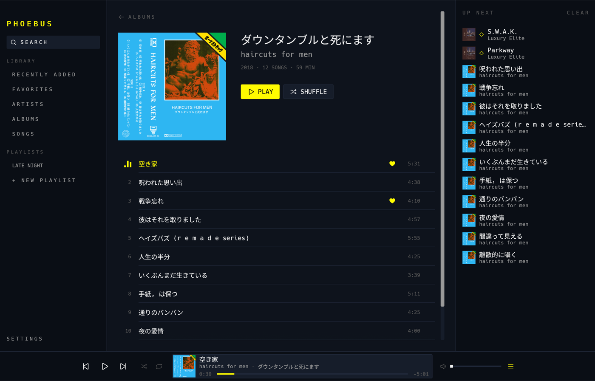
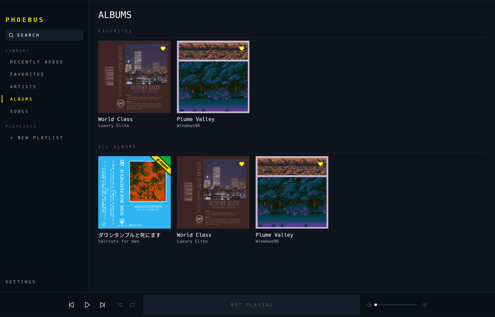
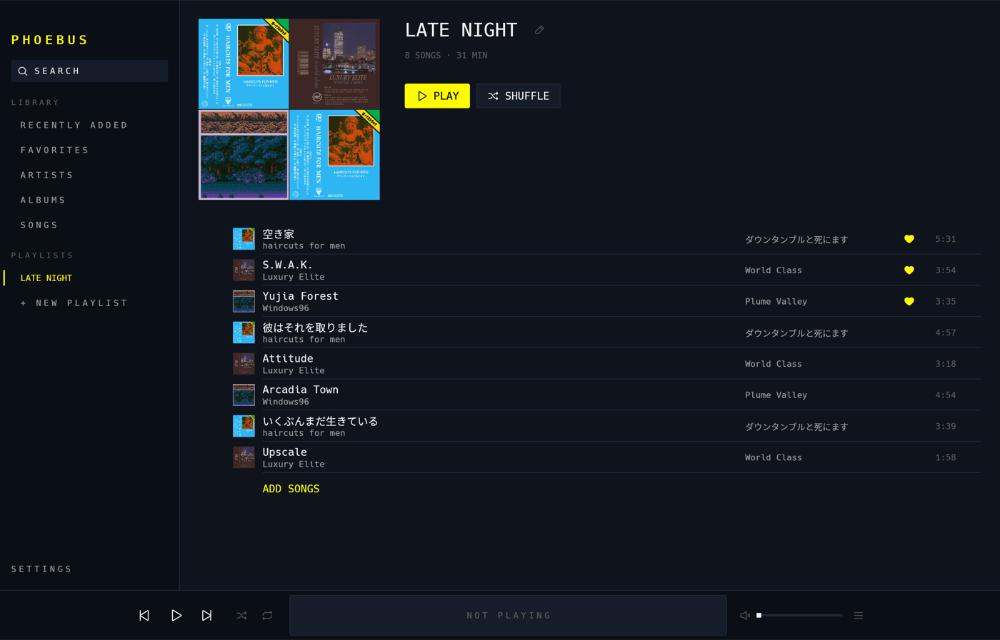
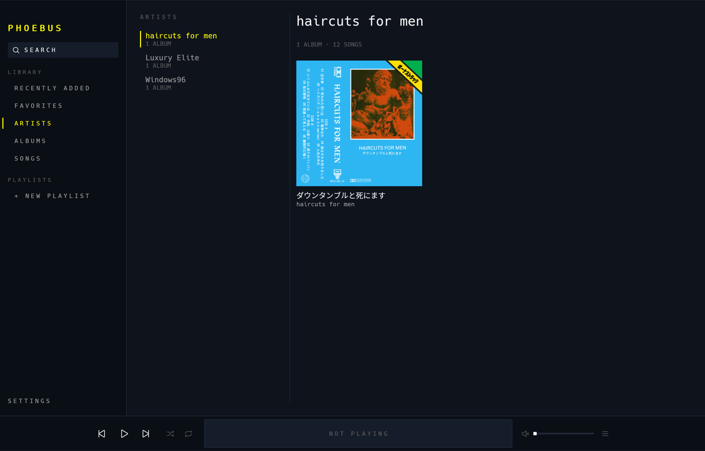
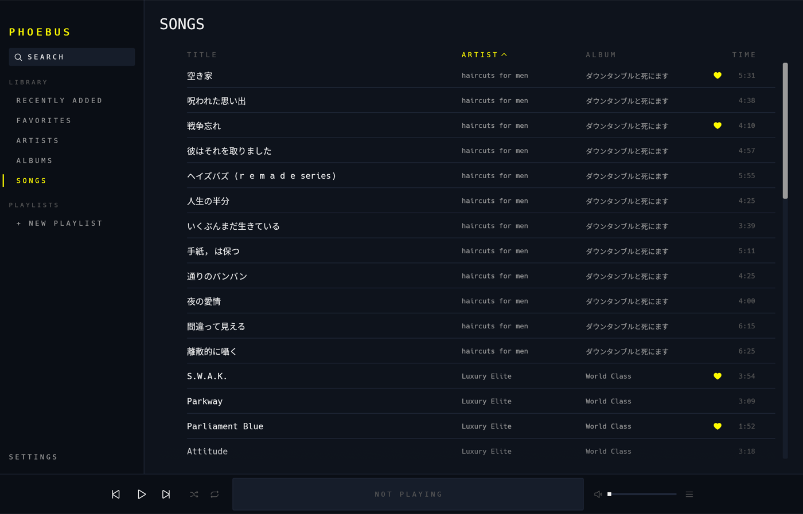

# PHOEBUS ●

A local music player for macOS and Linux that works like Apple Music and looks like a
terminal: pure black, mono type, one neon-yellow accent. Written entirely in Rust.

No streaming, no accounts, no network. Your files, played fast.



|  |  |
|:--:|:--:|
|  |  |

## Install

Grab the latest build from [Releases](https://github.com/ferriskleier/phoebus/releases) —
no toolchain needed.

**macOS** — download `Phoebus-macos-universal.zip`, unzip, move `Phoebus.app` to
`/Applications` if you like, and open it. The app is not notarised, so the first launch
is blocked by Gatekeeper: right-click → **Open** once, or

```
xattr -dr com.apple.quarantine /Applications/Phoebus.app
```

Works on both Apple silicon and Intel (universal binary).

**Linux** — download `phoebus-linux-x86_64.tar.gz`, unpack, run:

```
tar xzf phoebus-linux-x86_64.tar.gz
./phoebus-linux-x86_64/phoebus
```

Needs ALSA (`libasound2`) and D-Bus at runtime — present on any desktop distro. For a
launcher entry and icon, copy `phoebus.desktop` into `~/.local/share/applications/` and
the bundled `icons/hicolor` tree into `~/.local/share/icons/`, with `phoebus` somewhere
on your `PATH`.

## Library

Phoebus reads `~/.phoebus/` by default, laid out exactly like Apple Music's media folder:

```
~/.phoebus/
  Artist Name/
    Album Name/
      01 Track.m4a
      02 Track.m4a
```

Formats: m4a (AAC + ALAC), mp3, flac, ogg, wav, aiff, aac. Tags are read with sensible
fallbacks — an untagged `Artist/Album/01 Title.mp3` still lands in the right place.

Point it anywhere in **Settings** (sidebar, bottom) — including straight at
`~/Music/Music/Media.localized/Music`. Phoebus only ever *reads* the library root: app data
(state, playlists, cover cache) lives in `~/.phoebus/.phoebus/`, never in your music.

## Omarchy

On [Omarchy](https://omarchy.org), Phoebus can wear the active system theme — surfaces,
accent and dark/light mode, switching live with `omarchy-theme-set` — and ship a widget
for the Omarchy bar. One command wires both up:

```
contrib/omarchy/install.sh
```

Media keys and the built-in bar media widget already control Phoebus with nothing
installed (it is a full MPRIS player). See [contrib/omarchy](contrib/omarchy/README.md)
for how the bridge works and how to undo it.

## Build & run

```
cargo build --release
./target/release/phoebus
```

Requires Rust 1.95+. On Linux you'll want ALSA headers (`libasound2-dev`) and the
usual X11/Wayland dev packages for winit.

The binary carries its own icon, so the window, the taskbar and the macOS Dock all show it
straight out of `cargo run`. For a real app instead of a binary:

```
scripts/bundle-macos.sh     -> target/bundle/Phoebus.app, icns and Info.plist included
```

On Linux, copy `assets/icon/hicolor/` into `~/.local/share/icons/` and
`assets/linux/phoebus.desktop` into `~/.local/share/applications/`. The artwork itself
lives in `assets/icon/` as SVG; `scripts/make-icons.sh` regenerates every raster from it
(`assets/README.md` has the details).

## What it does

- **Views**: Recently Added, Artists, Albums, Songs (sortable, virtualized), per-album
  pages, Playlists, live Search (`⌘F`).
- **Player**: play/pause, prev/next, seek, volume, shuffle, repeat (off/all/one),
  Up Next queue with Play Next / Play Later, playback history.
- **Playlists**: create, rename inline, delete, reorder; add songs from any right-click
  menu, or with `+ ADD SONGS` — a picker over the whole library with a live filter.
- **Queue semantics** match Apple Music: playing a song makes its surrounding list the
  context; hand-queued songs always jump the line and survive context switches.
- **Media keys & Now Playing**: hardware play/pause/next/prev, with title, artist and
  cover art in macOS Control Center (MPRIS on Linux).
- **Settings**: pick the library root (`~` expanded, applied with a rescan) and the look —
  dark or light, six accent presets or any colour you like. Applied live, saved on the spot.
- **Resizable panels**: every vertical divider drags — the sidebar, the Up Next drawer and
  the Artists split.
- State (volume, view, shuffle/repeat, window, panel widths, root, theme) persists across
  launches.

Keyboard: `Space` play/pause · `⌘F` search · `⌘←/→` prev/next · `⌘↑/↓` volume · `Esc`
closes the queue drawer / leaves search. (`Ctrl` on Linux.)

## Environment

| variable | effect |
|----------|--------|
| `PHOEBUS_LIBRARY` | library root for this run; outranks the Settings value (which is then disabled) |
| `PHOEBUS_DATA` | app-data dir; default `~/.phoebus/.phoebus` |
| `PHOEBUS_THEME` | `dark` / `light` / `light,#2EF0FF` — palette for one run, never saved |
| `PHOEBUS_START_MUTED` | `1` starts at volume 0 without persisting it |
| `PHOEBUS_SELFTEST_EXPECT` | `"albums,artists,tracks"` minimums for `--selftest` |

## Verification

```
./target/release/phoebus --selftest    # headless: scan, tags, decode, seek, persistence
./target/release/phoebus --shot DIR    # screenshot tour of every view into DIR
```

`--selftest` requires at least one album by default. Setting `PHOEBUS_DATA` and
`PHOEBUS_LIBRARY` to temporary directories together keeps a whole verification run off your
real home.

## Workspace

```
crates/phoebus-core    library model, scanner, playlists, queue, search  (no UI deps)
crates/phoebus-audio   playback engine on a dedicated thread (rodio)
crates/phoebus-app     the egui app
```
